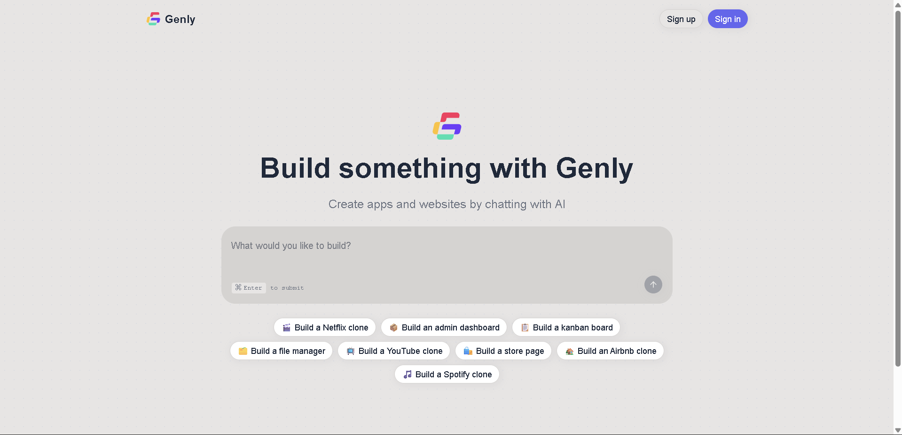

# ⚙️Genly - AI-Powered website Builder

Genly is an **AI website builder** that lets you generate full-stack website from simple prompts using programmable AI agents powered by **Inngest**.  

With support for **OpenAI**, **Anthropic**, and **Grok**, Genly creates entire website and executes them securely inside **cloud sandboxes** powered by **E2B** and **Docker**.  

It comes with a modern developer experience including background job orchestration, authentication, billing, a project dashboard, and a seamless workflow.

**[View Project](https://genly-lemon.vercel.app/)** 👈  



---

## ✨ Features

Genly comes packed with cutting-edge features to make full-stack website building with AI seamless and powerful:

- **AI-Powered website Generation** – Create entire website or individual components from simple natural language prompts.  
- **Programmable AI Agents** – Build with Inngest’s agent toolkit for orchestrating multi-step workflows.  
- **Background Job Orchestration** – Reliable async tasks powered by Inngest.  
- **Authentication & Billing** – Secure login, user management, and subscriptions powered by Clerk.  
- **Credit System & Usage Tracking** – Track resource usage with a built-in credit system.  
- **Live Preview with Shareable URLs** – Instantly see your generated projects in action.  
- **Code Explorer Toggle** – Switch between running preview and underlying code.  
- **E2B Cloud Sandboxes** – Secure, isolated environments for runtime execution.  
- **Docker Sandbox Templates** – Easily reproducible and customizable sandbox setups.  
- **Database Integration** – Seamless Prisma + Neon database setup for persistence.  
- **AI Model Flexibility** – Choose from OpenAI, Anthropic, or Grok for generation.  
- **Modern Frontend Stack** – Built with Next.js 15, React 19, Tailwind v4, and Shadcn/ui.  
- **Type-Safe APIs** – End-to-end type safety with tRPC.  
- **Scalable Architecture** – Designed for production-ready, AI-first web-app.

---

## 🛠️ Tech Stack

Genly is built on a **modern AI toolchain** combining frontend, backend, cloud, and AI services:

| Category              | Technologies                                                                 |
|-----------------------|-------------------------------------------------------------------------------|
| **Frontend**          | [Next.js 15], [React 19], [Tailwind CSS v4], [Shadcn/ui] |
| **Backend & APIs**    | [tRPC], [Inngest], [Prisma] |
| **Database**          | [PostgreSQL], [Neon] [serverless Postgres] |
| **Auth & Billing**    | [Clerk] – [authentication], [user management] & [billing] |
| **AI & Automation**   | [OpenAI], [Anthropic], [Grok], [Inngest Agent Toolkit], [CodeRabbit] |
| **Runtime & Infra**   | [E2B], [Docker] |
| **Dev Experience**    | [GitHub], [GitHub Actions], [Prettier], [ESLint] |

   

---

## 🚀 Getting Started

To set up **Genly** locally:

1. **Clone the repository:**
   ```bash
   git clone https://github.com/your-username/genly.git


## 📬 Contact

Feel free to reach out if you'd like to connect or collaborate on a project!

-   **LinkedIn:** [linkedin.com/in/nitingond](https://linkedin.com/in/nitingond)
-   **GitHub:** [@nitingond1001](https://github.com/nitingond1001)
-   **Email:** nitingond.1602@gmail.com
